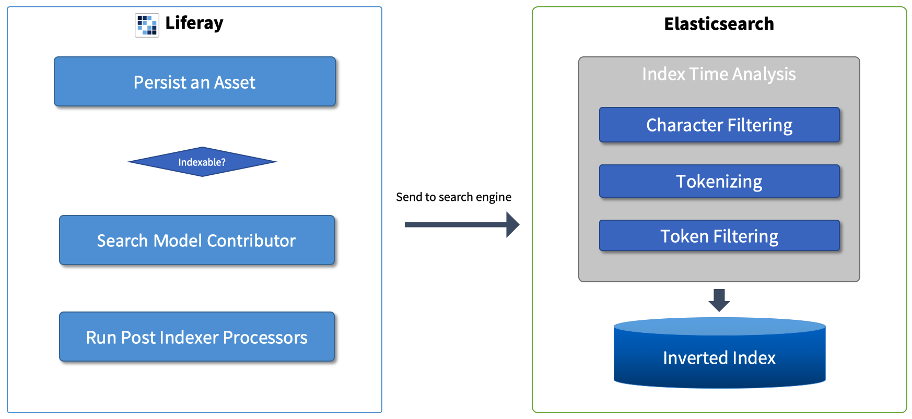
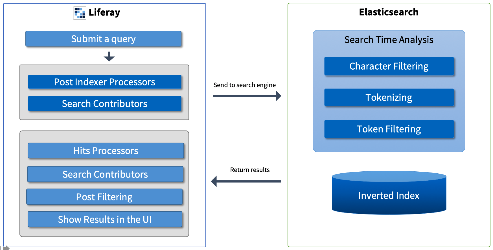

title: Liferay Search
class: animation-fade
layout: true

.bottom-bar[
  {{title}}
]

---

class: impact

# {{title}}
christian.berndt@liferay.com 

---

class: agenda

# .inner[Agenda]

.items[
* .active[Search Concepts]
* User Interface
* Configuration Options
* Questions 
]

---

title: Liferay Search 
layout: true

###.breadcrumbs[Liferay Search › Search Concepts]

.bottom-bar[
  {{title}}
]

---

# Search Concepts 

## Overview 

* Why an external search engine?
* Supported search engines
* Indexing
* Analysis
* Searching
* Queries
* Filter Queries 

---

# Search Concepts

## Why an External Search Engine?

* Search engines use algorithms and structures like the __inverted index__, that are optimized for speed
* __Analysis__: optimize data for searchability
* Support for __relevance__ and __scoring__
* Support for __advanced query types__ and features like fuzzy or proximity searches
* __Joins are expensive__; RDBMS data structures are not optimal for searching 
* __Performance and load balancing__: search engines typically run in dedicated servers 

---

# Search Concepts

## Supported Search Engines

* __Elasticsearch__ (default)
* Solr
* Both, Elastic and Solr built on the Apache Lucene library 

---

# Search Concepts

## Indexing

* The process of __transforming a portal asset into a search engine index document__ 

---

# Search Concepts

## Analysis

* A field-level process of transforming input data to search engine data
* Performed both at indexing and search time
* Phases:
  * Character filtering, e.g. removing of HTML tags
  * Tokenize the field value to obtain individual words or tokens
  * Token filtering: language-specific analysis, stop words removal, etc.
* Can be configured for each field individually in the mapping definitions

---

# Search Concepts

## How Does Indexing Work?

---

# Search Concepts

## Searching

* Sending a search query and obtaining results (__hits__) from the search engine
* The search query analysis should __match__ the index time analysis
* Searching involves __queries and filters__

---

# Search Concepts

## Queries

* Asks whether an index document field matches the keywords in a defined way
* May define how __relevant__ the document field is to the search terms (score)
* The query properties include:
  * __Type__ like exact match, wildcard, etc.
  * __Operator__ like AND, OR, and NOT
  * __Field boosting__

---

# Search Concepts

## Filter Queries

* A regular query, but it works in a __filter context__
* Returns only a simple __“yes”__ or __“no”__ to its condition
* Could be used, for example, to limit results belonging only to a certain site
* __Does not affect scoring__
* Much __faster__ than regular queries. Using filters is preferred whenever possible.

---

# Search Concepts

## How Does Searching Work?

---

class: agenda

# .inner[Liferay Search]

.items[
* Search Concepts
* .active[User Interface]
* Configuration Options
* Questions 
]

---

title: Liferay Search 
layout: true

###.breadcrumbs[Liferay Search › User Interface]

.bottom-bar[
  {{title}}
]

---

# User Interface 

.col-6[
## Default Search Page 

* Search Bar
* Suggestions
* Site Facet
* [Asset] Type Facet  
* Tag Facet
* Category Facet
* Folder Facet
* User Facet
* Modified Facet 
]

.col-6[
## Additional Widgets

* Sort
* Search Options
* Search Insights
* Low Level Search Options  

]
---

class: agenda

# .inner[Liferay Search]

.items[
* Search Concepts
* User Interface
* .active[Configuration Options]
* Questions 
]

---

title: Liferay Search 
layout: true

###.breadcrumbs[Liferay Search › Configuration Options]

.bottom-bar[
  {{title}}
]

---

# Configuration Options 

## Overview

* Search Tuning
* Index Actions and Field Mappings
* Search Settings at System Level
 
---

class: agenda

# .inner[Liferay Search]

.items[
* Search Concepts
* User Interface
* Configuration Options
* .active[Questions]
]

---

title: Liferay Search 
layout: true

###.breadcrumbs[Liferay Search › Questions]

.bottom-bar[
  {{title}}
]

---

# Questions 

## Overview

* Gibt es Meta-Informationen zur Verbesserung der Trefferquote?
* Was wird in der Suche indexiert?
* Ordnung/Reihenfolge der Suchergebnisse (Boost)?
* Handhabung der Sprache und Segmentierung der Suchergebnissen?
* Segmentierung/Themen-Clusterung?

---

 
