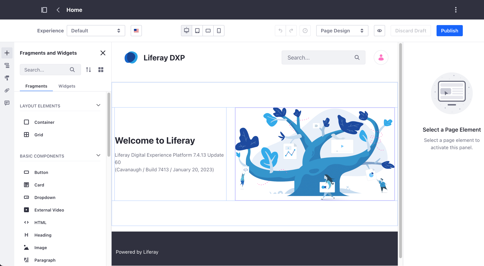
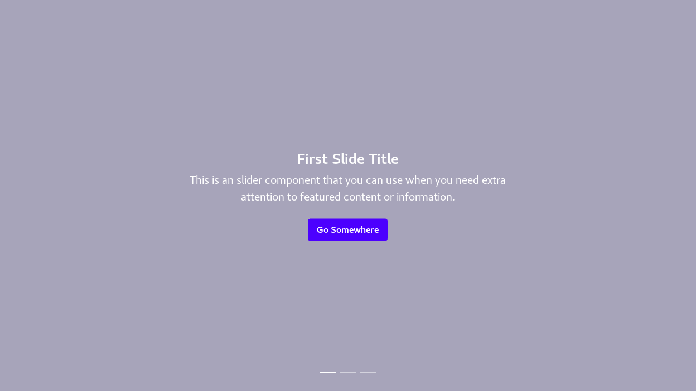
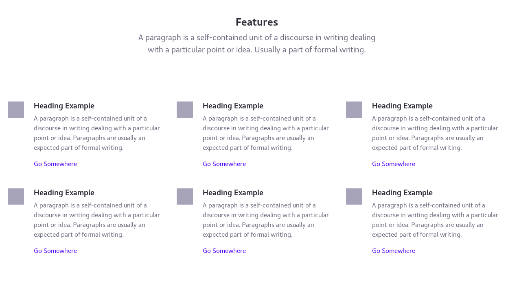
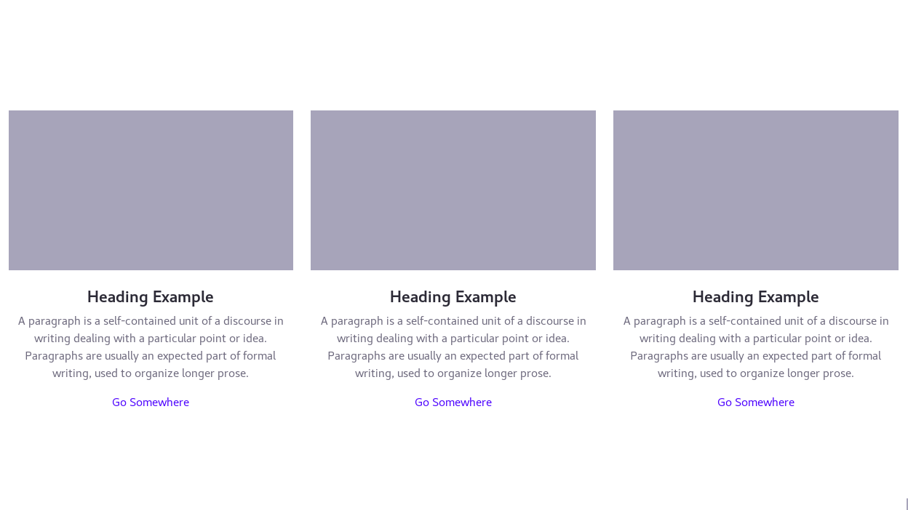
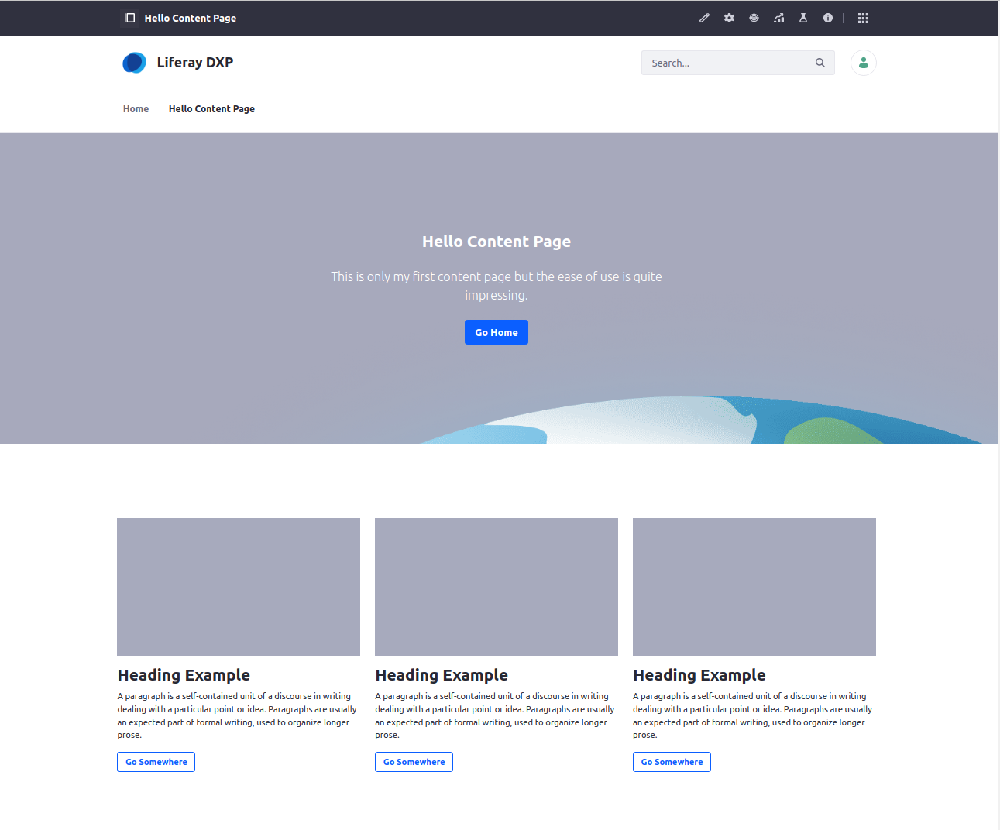

title: Content Pages and Fragments
class: animation-fade
layout: true

.bottom-bar[
  {{title}}
]

---
class: impact

.logo[]

## Work in Progress

# {{title}}

christian.berndt@liferay.com

.date[
  Vienna, 13 February 2023
]

---

class: agenda

# .inner[Agenda]

.items[
1. .active[Introduction]
1. Visual Fragment Composition
1. Developing Fragments
]

---

title: Content Pages and Fragments
layout: true

###.breadcrumbs[Content Pages and Fragments]

.bottom-bar[
  {{title}}
]

---

# Introduction

.col-5[
## Content Pages: General Concepts
* First introduced in Liferay 7.1
* Page centered content managment (in addition to Asset based)
* Composed of Fragments and / or Widgets
]

.col-1[
  &nbsp;
]

.col-6[
  .center[]
]

.footnote[
  https://learn.liferay.com/dxp/7.x/en/site-building/creating-pages/building-and-managing-content-pages/content-pages-overview.html
]

???

* *First introduced in Liferay 7.1*
  * since 7.3 a level of maturity where it can in fact be considered as production ready
* *Page centered content management*
  * in a way complementary to Liferay's traditional, asset based approach to content management (Web Content Display and Asset Publisher Portlets, Web Content Articles and Document and Media Files)
* *Composed of so called Fragments*
  * easy to use page blocks which can easily be deployed to a page via drag and drop
  * Widgets (Portlets) supported as well
---

# Introduction

## Content Page Features

* View and Draft
* Inline Editing of Content
* Support for Experiences
* Support of Workflows

???

* *View and Draft*
  * Every content page has a draft mode which allows for preparing and editing page content without publishing the changes immediately (like for widget pages)
* *Inline Editing of Content*
  * provides immediate feedback to the editor and a true WYSIWYG authoring experience
* *Support for Experiences*
  * Content pages support the concept of so called "Experiences" - Liferay's term for personalized content.
  * Display specific parts of a page according to configurable criteria, e.g. Geo location, Language Settings, etc.
* *Support for Workflows*
  * Content pages can be configured to support workflows which model approval or review processes

---

# Introduction

## Fragment Examples

.col-4[
  .center[]
]

.col-4[
  .center[]
]

.col-4[
  .center[]
]

---

# Introduction

.col-5[

## Exercise: Hello Content Page

1. Create an empty page
1. Define the page structure by adding OOTB fragments
1. Edit page content
1. Publish the draft

]

.col-1[
  &nbsp;
]

.col-6[
  .center[]
]

---

class: agenda

# .inner[Agenda]

.items[
1. Introduction
1. .active[Visual Fragment Composition]
1. Developing Fragments
]

---

# Visual Fragment Composition

## General Characteristics 

* Part of Liferay's Low Code / No Code approach
* Meant to empower Business Users
* Meant to increase productivity and agility

???

* *Why create custom fragments?*
  * OOTB Fragments might not cover your team's communication needs
* *Why visually compose fragments?*
  * Enable Business UsersBusiness Users  to tailor fragments according to their needs
* *Meant to increase productivity and agility*
  * Adjusting styles does not necessarily require development resources

---

# Visual Fragment Composition

.col-5[
## Exercise: Compose a Video Card

1. Create a Custom Fragment Set
1. Create an Empty Content Page
1. Compose Your Custom Fragment
1. Style the Fragment Components
1. Save the Video Card 
1. Test the Video Card  
]

.col-1[
  &nbsp;
]

.col-4[
  .center[]
]

---

class: agenda

# .inner[Agenda]

.items[
1. Introduction
1. Visual Fragment Composition
1. .active[Developing Fragments]
]

---

# Developing Fragments

## General Characteristics

* Self contained blocks of HTML, CSS, and Javascript
* Embedded "Editable Elements"
* Support for "Drop Zones"
* Configurable
* Support for Freemarker

---

# Developing Fragments

## Anatomy of a Fragment

.col-5[

Fragment code (legacy syntax)

```html
<div class="sample-fragment">
  <h1>
*    <lfr-editable id="title" type="text">
      Sample fragment
*    </lfr-editable>
  </h1>
</div>
```

Fragment code (new syntax)
```html
<div class="sample-fragment-with-new-editables">  
*  <h1 data-lfr-editable-id="title" 
*      data-lfr-editable-type="text">
    Sample fragment with new editables
  </h1>
</div>
```
]

.col-2[
  &nbsp;
]

.col-5[
Rendered as 
```html
<div class="sample-fragment">
  <h1>
    <div>
      Sample fragment
    </div>
  </h1>
</div>
```

Rendered as

```html
<div class="sample-fragment-with-new-editables">  
  <h1 data-lfr-editable-id="title" 
      data-lfr-editable-type="text">
    Sample fragment with new editables
  </h1>
</div>
```
]

---

# Developing Fragments

## Tooling

* Built-in Fragment Editor
* External Fragment Toolkit

???

* *Built-in Fragment Editor*
  * Primarily meant to test modifications
* *External Fragment Toolkit*
  * Node based CLI Toolkit
  * Based on yeoman, a popular scaffolding tool in the node world

---

# Developing Fragments

.col-5[ 
## Exercise: Using the Built-in Editor
  1. Implement the HTML
  1. Style with CSS
  1. Add Javascript
  1. Deploy and Test
]

.col-1[
  &nbsp;
]

.col-6[
  .center[]
]

---

# Developing Fragments

## Setup Your Environment

* Install Fragments Toolkit
* Start Liferay
* Create, Deploy, and Review Fragments

---

# Developing Fragments

## Exercise: Setup the Fragment Toolkit

1. Setup Node (preferably by means of a version manager, e.g. nvm)
1. Install required packages
1. Create your first fragment project with `yo`

---

# Developing Fragments

## Fragments Toolkit Capabilities

| | | |
|-|-|-|
|`yarn run add-collection`| &nbsp;&nbsp; | Add a new Fragments collection |
|`yarn run add-fragment` | | Add a new Fragment |
|`yarn run add-fragment-composition` | | Add a new Fragment composition |
|`yarn run add-page-template` | | Add a new Page Template |
|`yarn run compress`| | Assemble collection as ZIP archive |
|`yarn run export`| | Export a collection *from* Liferay |
|`yarn run import`| | Import a collection *into* Liferay |
|`yarn run import:watch`| | Import a collection *into* Liferay in watch mode |
|`yarn run preview`| | Preview Fragments |

---

# Content Pages and Fragments

.col-6[

## 1. Create a New Fragment Project

> Run `yo liferay-fragments`

```bash
berndt@x270:~$ yo liferay-fragments

    / /   /  _/ ____/ ____/ __ \/   \ \/ /
  / /    / // /_  / __/ / /_/ / /| |\  /
  / /____/ // __/ / /___/ _, _/ ___ |/ /
/_____/___/_/   /_____/_/ |_/_/  |_/_/

? Project name Sample Liferay Fragments
? Add sample content? n

Creating directory
   create src/.gitkeep
   create .editorconfig
   create .gitignore
   create package.json
   create README.md

Done!
You're ready to create fragments.
```
]

--

.col-6[

## 2. Create a New Collection

> Run `yarn run add-collection`

```bash
berndt@x270:sample-liferay-fragments$ yarn run add-collection
yarn run v1.22.5
warning package.json: No license field
$ yo liferay-fragments:collection
? Collection name (required) Custom Fragment Collection
? Collection description (optional) A collection of custom fragments
   create src/custom-fragment-collection/collection.json
Done in 49.25s.
```
]

---

# Content Pages and Fragments

.col-6[

## 3. Create a New Fragment

> Run `yarn run add-fragment`

```bash
berndt@x270:sample-liferay-fragments$ yarn run add-fragment
yarn run v1.22.5
warning package.json: No license field
$ yo liferay-fragments:fragment
? Minimum liferay version you want fragments to be compatible with (e.g. 7.3.0) 7.3.10
? Fragment name (required) Keyvisual
? Choose a collection (custom-fragment-collection)
   create src/custom-fragment-collection/keyvisual/index.html
   create src/custom-fragment-collection/keyvisual/main.js
   create src/custom-fragment-collection/keyvisual/styles.css
   create src/custom-fragment-collection/keyvisual/fragment.json
   create src/custom-fragment-collection/keyvisual/configuration.json
Done in 37.89s.
```
]

--

.col-6[

## 4. Deploy to Server

> Run `yarn run import:watch`

```bash
berndt@x270:sample-liferay-fragments$ yarn run import:watch
yarn run v1.22.5
warning package.json: No license field
$ yo liferay-fragments:import --watch
? Liferay host & port http://localhost:8080
? Username test@liferay.com
? Password [hidden]

Checking connection...
Connection successful

? Company ID liferay.com
? Group ID (Use arrow keys)
  Global
❯ Liferay DXP

```

]


