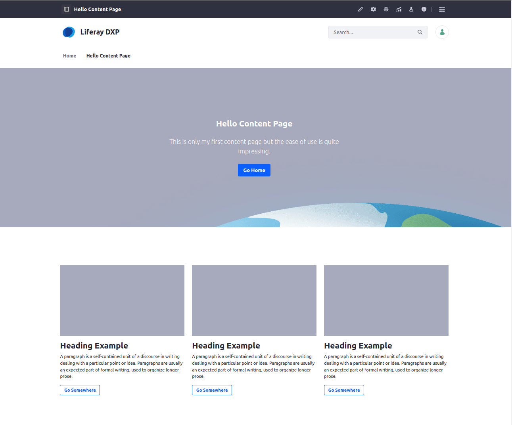

title: Liferay Objects
class: animation-fade
layout: true

.bottom-bar[
  {{title}}
]

---
class: impact

.logo[]

## Sales Engineering 

# {{title}}

christian.berndt@liferay.com

.date[
  Vienna, 16 June 2023
]

---

class: agenda

# .inner[Agenda]

.items[
1. .active[Introduction]
1. Concepts and Terms
1. Live Demo
1. Questions and Discussion 
]

???

* Hello everyone! Thanks for the opportunity to introduce you to Liferay Objects, one of the coolest new features of the Liferay platform.

* Before we start with the presentation, I would suggest to have a quick round of introductions, two or three sentences about your previous experience with Liferay, your role in the procurement/application process, and your expectations for today's presentation.

* To start with myself: my name is Christian Berndt. I have been working with Liferay for more than twelve years now, first as a lead developer for a small Swiss software company and the last five years as a trainer and senior consultant for Liferay itself.

* As for the flow of the event: feel free to ask questions directly during the presentation. Otherwise, I have provided time for discussion and questions at the end of the presentation. 

---

title: Liferay Objects
layout: true

###.breadcrumbs[Liferay Objects]

.bottom-bar[
  {{title}}
]

---

# Introduction

.col-5[
## What are Liferay Objects?
* A key component of Liferay's Low Code / No Code strategy
* A way to visually compose applications, complete with backend and graphical user interface
* A way to empower business users to build, deliver, and manage applications within Liferay
]

.col-1[
  &nbsp;
]

.col-6[
  .center[]
]

???

* Together with Content Pages and Search Blueprints, Liferay Objects are a key component of Liferay's low code / no code strategy.

* In short, Liferay Objects are a way to visually compose applications complete with backend code and graphical user interface.

* And are meant to empower business users to build, deliver, and manage applications within the Liferay platform.

---

# Introduction

.col-5[

## Liferay Objects: An Example 

* Visually define a business object 

]

.col-1[
  &nbsp;
]

.col-6[
  .center[]

]

???

* Liferay Objects allows you to build applications without having to write code or deploy modules.

---

# Introduction

.col-5[

## Liferay Objects: An Example 

* Visually define the user interface

]

.col-1[
  &nbsp;
]

.col-6[
  .center[]
]

---

class: agenda

# .inner[Agenda]

.items[
1. Introduction
1. .active[Concepts and Terms]
1. Live Demo
1. Questions and Discussion 
]

???

* TODO

---

# Concepts and Terms 

## Low Code / No Code 

* TODO  

---

# Concepts and Terms

## Objects Use Cases 

* TODO

---

class: agenda

# .inner[Agenda]

.items[
1. Introduction
1. Concepts and Terms
1. .active[Live Demo]
1. Questions and Discussion 
]

???

* TODO

---

# Live Demo

## Define the Business Object

1. Open the Objects editor in the Control Panel
1.  

???

* Liferay ships with a number of preconfigured business objects but what we're interested in is defining a custom object, for example a 

---

# Live Demo 

## Summary: Objects Capabilities 

*   

???

* TODO

---

class: agenda

# .inner[Agenda]

.items[
1. Introduction
1. Concepts and Terms
1. Live Demo
1. .active[Questions and Discussion]
]

???

* TODO

