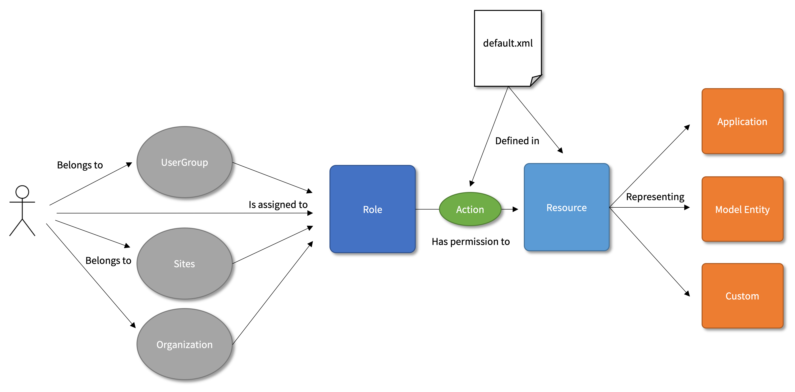

title: Liferay Permission Management 
class: animation-fade
layout: true

.bottom-bar[
  {{title}}
]

---

class: impact

# {{title}}
christian.berndt@liferay.com 

---

class:agenda

# .inner[Liferay Permissions]

.items[
* .active[Overview]
* Content Management
* User Management
* Permissions and Roles
* Management Tasks
]

---

title: Liferay Permission Management 
layout: true

###.breadcrumbs[Liferay Permission Management › Overview]

.bottom-bar[
  {{title}}
]

---

# Overview 

<p style="text-align: center;">
  
</p>

---

title: Liferay Permission Management 
layout: true

.bottom-bar[
  {{title}}
]

---

class: agenda

# .inner[Liferay Permissions]

.items[
* Overview
* .active[Content Management]
* User Management
* Permissions and Roles 
* Management Tasks
]

---

title: Liferay Permission Management 
layout: true

###.breadcrumbs[Liferay Permission Management › Content Management]

.bottom-bar[
  {{title}}
]

---

# Liferay Content Management

## Basic Concepts

* Assets
* Sites
* Pages
* Widgets

---

# Assets 

## A generic term to refer to all user content stored and managed by Liferay

* PDF Documents 
* Blog Posts
* Wiki Pages 

---

# Asset Framework

## A framework providing common features for heterogeneous content

* Tagging and Categorizing
* Ranking and Commenting
* Commenting and Flagging

---

# Sites

## The main building block to group content

* Used to store content in a common scope
* Used to host pages
* Available with different membership options
* Hierarchically stackable

---

# Sites

## Site Scopes

* Regular scope 
* Global scope
* User scope

---

# Sites

## Membership types

* Open
  * User managed
* Restricted
  * Membership request must be approved by Site Administrator
* Private 
  * Invitation only

---

# Sites

## Managing Site Memberships

* __Manually__
  * _Site Administration → Members→Site Memberships_
* __Automatically__
  * _Control Panel → Configuration → Instance Settings → Users → Default User Associations_
* __Automatic Site Role Assignation__ 
  * _Site Administration → Configuration → Site Settings → Advanced → Default User Associations_
  * Will assign default Roles and Teams to new Site Members

---

# Sites

## Site Hierarchies

* Allows to share content within the same hierarchy
* Used to group user memberships

---

title: Liferay Permission Management 
layout: true

.bottom-bar[
  {{title}}
]

---

class: agenda

# .inner[Liferay Permissions]

.items[
* Overview
* Content Management
* .active[User Management]
* Permissions and Roles 
* Management Tasks
]

---

title: Liferay Permission Management 
layout: true

###.breadcrumbs[Liferay Permission Management › User Management]

.bottom-bar[
  {{title}}
]

---

# User Management Concepts

## Overview 

* User 
* Organization 
* User Group
* Team

---

# User

## A Person (or System) Engaging With the Liferay Platform

* A user can sign in to the portal 
* Required for all permission-checking operations
* All content is user bound
* Foundation for Liferay's GDPR features

---

# Organization

## Hierarchical Grouping of Users

* Delegate user administration within a hierarchy
* Organization Administrators can manage all the Users in their Organization and in any sub-Organization
* Members of child Organizations are implicit members of their parent Organizations
* May have a Site

---

# User Group

## Non-hierarchical Grouping of Users

* Can be used for vertical and horizontal grouping of Users
* Can be used to manage Site memberships
* Manage user personal pages
* Collect permissions
* Mappable to LDAP-groups

---

# Organization

## Organization Types

* Align Organization names with real world entities (Unit, Department, Team)
* Define allowed child types 

---

# Team

## Grouping of Site Members

* Assign permissions to a group of users within the current site
* Permission assignments apply only to the current site

---

title: Liferay Permission Management 
layout: true

.bottom-bar[
  {{title}}
]

---

class: agenda

# .inner[Liferay Permissions]

.items[
* Overview
* Content Management
* User Management
* .active[Permissions and Roles]
* Management Tasks
]

---

title: Liferay Permission Management 
layout: true

###.breadcrumbs[Liferay Permission Management › Permissions and Roles]

.bottom-bar[
  {{title}}
]

---

# Permissions and Roles

## Basic Concepts

* Resource
* Action
* Permission
* Roles

---

# Resources

## What is a *Resource*?

* A generic representation of any application or entity used as an __action target__.

## Types of Resources

* Portlet Resources
* Model Resources 

---

# Resources

## Resource Examples

* An instance of a Blogs portlet
* A wiki page
* A blogs st 
* A document
* A site

---

# Actions

## Operations performed on a Resource, e.g.

* Portlet Actions
  * `ADD_PORTLET_DISPLAY_TEMPLATE` 
  * `ADD_TO_PAGE` 
  * `CONFIGURATION` 
  * `VIEW` 
* Model Actions
  * `ADD_ENTRY` (root model)
  * `PERMISSIONS` (root model)
  * `ADD_DISCUSSION` (model)
  * `DELETE` (model)
  * `PERMISSIONS` (model)
  * `UPDATE` (model)
---

# Permissions

## Actions Performed on a Resource, e.g. 

* An action that can be performed on a resource
* A combination of a resource and an action, for example:
  * `com_liferay_blogs_web_portlet_BlogsPortlet` + `ADD_TO_PAGE`
  * `com_liferay_blogs_web_portlet_BlogsPortlet` + `VIEW`
  * `com.liferay.blogs` + `ADD_ENTRY`
  * `com.liferay.blogs.model.BlogsEntry` + PK + `DELETE`


---

# Permissions 

## Portlet Resource Definition

```xml
<resource-action-mapping>
  <portlet-resource>
    <portlet-name>com_liferay_blogs_web_portlet_BlogsPortlet</portlet-name>
    <permissions>
      <supports>
        <action-key>ADD_PORTLET_DISPLAY_TEMPLATE</action-key>
        <action-key>ADD_TO_PAGE</action-key>
        <action-key>CONFIGURATION</action-key>
        <action-key>VIEW</action-key>
      </supports>
      <site-member-defaults>
        <action-key>VIEW</action-key>
      </site-member-defaults>
      <guest-defaults>
        <action-key>VIEW</action-key>
      </guest-defaults>
      <guest-unsupported>
        <action-key>ADD_PORTLET_DISPLAY_TEMPLATE</action-key>
        <action-key>CONFIGURATION</action-key>
      </guest-unsupported>
    </permissions>
  </portlet-resource>
</resource-action-mapping>
```

---

# Permissions

## Model Resource Definition (root model permission)

```xml
<resource-action-mapping>
  <model-resource>
    <model-name>com.liferay.blogs</model-name>
    <portlet-ref>
      <portlet-name>com_liferay_blogs_web_portlet_BlogsPortlet</portlet-name>
    </portlet-ref>
    <root>true</root>
    <weight>1</weight>
    <permissions>
      <supports>
        <action-key>ADD_ENTRY</action-key>
        <action-key>PERMISSIONS</action-key>
        <action-key>SUBSCRIBE</action-key>
      </supports>
      <site-member-defaults>
        <action-key>SUBSCRIBE</action-key>
      </site-member-defaults>
      <guest-defaults />
      <guest-unsupported>
        <action-key>ADD_ENTRY</action-key>
        <action-key>PERMISSIONS</action-key>
        <action-key>SUBSCRIBE</action-key>
      </guest-unsupported>
    </permissions>
  </model-resource>
  ...
```

---

# Permissions

## Model Resource Definition (model permission)

```xml
  <model-resource>
    <model-name>com.liferay.blogs.model.BlogsEntry</model-name>
    <portlet-ref>
      <portlet-name>com_liferay_blogs_web_portlet_BlogsPortlet</portlet-name>
    </portlet-ref>
    <weight>2</weight>
    <permissions>
      <supports>
        <action-key>ADD_DISCUSSION</action-key>
        <action-key>DELETE</action-key>
        <action-key>DELETE_DISCUSSION</action-key>
        <action-key>PERMISSIONS</action-key>
        <action-key>UPDATE</action-key>
        <action-key>UPDATE_DISCUSSION</action-key>
        <action-key>VIEW</action-key>
      </supports>
      <site-member-defaults>
        <action-key>ADD_DISCUSSION</action-key>
        <action-key>VIEW</action-key>
      </site-member-defaults>
      <guest-defaults>
        <action-key>ADD_DISCUSSION</action-key>
        <action-key>VIEW</action-key>
      </guest-defaults>
      <guest-unsupported>
        <action-key>DELETE</action-key>
        <action-key>DELETE_DISCUSSION</action-key>
        ...
        <action-key>UPDATE_DISCUSSION</action-key>
      </guest-unsupported>
    </permissions>
  </model-resource>
</resource-action-mapping>
``` 


---

# Roles 

## A Role is a collection of permissions assigned to 

* Users
* Organizations
* User Groups
* Sites

## Types of Roles

* Regular (instance scope)
* Site
* Organization 

Permissions are always assigned to Roles, never to individual Users

---

# Roles

.col-4[
## Regular Roles

* Administrator
* Guest
* Owner
* Power User
* User 
]

--

.col-4[
## Site Roles

* Site Administrator
* Site Member
* Site Owner
]

--

.col-4[
## Organization Roles

* Organization Administrator
* Organization Owner
* Organization Member
]

---

# Roles

## Implicit Permission Definitions

* __Administrator__
  * Super users within the respective scope (Portal, Organization, Site)
* __Site Owner, Organization Owner__
  * Super users within the respective scope with additional user management powers
* __Owner__
  * An implied role with respect to the objects users create

---

# Roles

## Explicit Permission Definitions

* __Guest__
* __User__
* __Power User__

---

# Roles

## Customizing Default Roles 

* In general: __Don't__ customize default roles
* But create your own

---

# Roles

## Defining Custom Roles

* Liferay Permissions are additive
* Follow the *principle of least permissions*
* Find the right scope
* Avoid overlapping Role definitions

---

# Summary 

<p style="text-align: center;">
  
</p>

---

class: agenda

# .inner[Liferay Permissions]

.items[
* Overview
* Content Management
* User Management
* Permissions and Roles
* .active[Management Tasks]
]

---

title: Liferay Permission Management
layout: true

###.breadcrumbs[Liferay Permission Management › Management Tasks]

.bottom-bar[
  {{title}}
]

---

# Tasks Overview

## Define Roles

* Define Roles reflecting real world responsibilities (e.g. Copy Editor, Content Reviewer, etc.)
* Grant required Permissions
* Provide usage instructions in the description field

## Assign Users

* Individually
* By means of User Groups
* By means of Organizations
* Programmatically

---

# Tasks Overview

## Documentation

* Describe typical Use Cases for each Role
* What is a Role member allowed to do?
* What is a Role member _not_ allowed to do?
* How does the Role definition relate to related fields (User management, Workflow definitions, Sites)?

---

# Distribute and Deploy Custom Role Definitions

## Deployment Tasks

* Transfer custom Role definitions from _dev_ to _uat_ and _prod_

## Deployment Options

* Export - Import (via Control Panel)
* Programmatically (by means of an OSGI Component)

## Challenges

* How to maintain / modify / update / extend custom Role definitions?
* How to avoid conflicts between manual and programmatical Role management?
